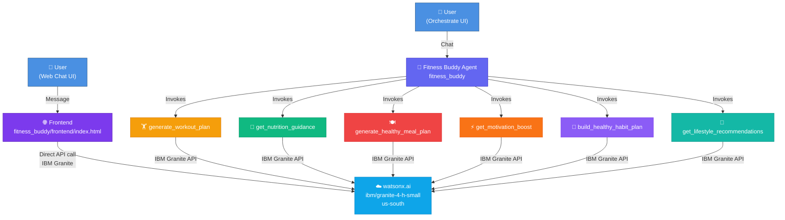
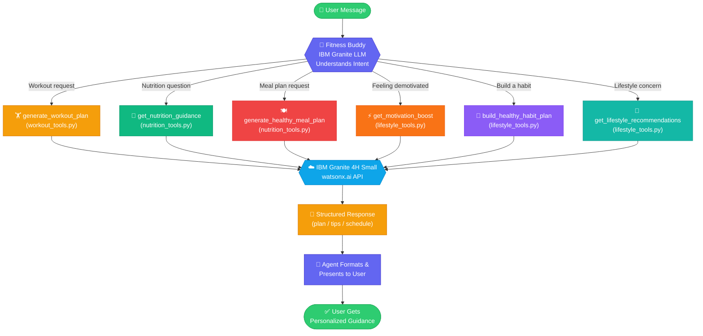

# Fitness Buddy 💪

**Your Personalized AI Wellness Coach — Powered by IBM Granite on watsonx.ai**

Fitness Buddy is a fully featured AI agent built with **IBM watsonx Orchestrate** and **IBM Granite 4H Small**. It delivers personalized workouts, nutrition guidance, healthy meal plans, motivational support, habit-building programs, and safe lifestyle recommendations — all in real time.

---

## Architecture Diagram



---

## Agent Flow Diagram



---

## Project Structure

```
fitness_buddy/
├── __init__.py
├── README.md
├── import-all.sh               # CLI import script
├── agents/
│   └── fitness_buddy.yaml      # Agent configuration (watsonx Orchestrate)
├── tools/
│   ├── __init__.py
│   ├── workout_tools.py        # generate_workout_plan tool
│   ├── nutrition_tools.py      # get_nutrition_guidance + generate_healthy_meal_plan
│   └── lifestyle_tools.py      # get_motivation_boost + build_healthy_habit_plan + get_lifestyle_recommendations
├── frontend/
│   └── index.html              # Standalone web chat UI (IBM Granite direct integration)
└── generated/                  # Generated flow specs (if any)
```

---

## Tools Reference

| Tool | File | Description |
|------|------|-------------|
| `generate_workout_plan` | `workout_tools.py` | Personalized workout plan (warm-up, main, cool-down, safety tips) |
| `get_nutrition_guidance` | `nutrition_tools.py` | Daily calorie target, macros breakdown, nutrition tips |
| `generate_healthy_meal_plan` | `nutrition_tools.py` | Full-day meal plan with ingredients & calories |
| `get_motivation_boost` | `lifestyle_tools.py` | Motivational message + 3 concrete action steps |
| `build_healthy_habit_plan` | `lifestyle_tools.py` | Week-by-week habit plan + science-backed hacks |
| `get_lifestyle_recommendations` | `lifestyle_tools.py` | Holistic lifestyle advice + sample daily schedule |

---

## IBM Granite Configuration

| Parameter | Value |
|-----------|-------|
| API Endpoint | `https://us-south.ml.cloud.ibm.com/ml/v1/text/generation?version=2023-05-29` |
| Model ID | `ibm/granite-4-h-small` |
| Project ID | `76edf6b0-8919-446e-93dc-43e0b6a7e481` |
| Decoding | Greedy |
| Max New Tokens | 600–800 |

---

## Usage

### Option 1: Web Chat UI (Standalone Frontend)

Open `frontend/index.html` directly in any modern browser. The page communicates directly with IBM Granite on watsonx.ai via your API key — no backend server needed.

```bash
# Windows
start fitness_buddy/frontend/index.html

# macOS
open fitness_buddy/frontend/index.html

# Linux
xdg-open fitness_buddy/frontend/index.html
```

Features:
- 🎨 Dark-themed chat UI with quick-action sidebar
- 💬 Multi-turn conversation with context memory
- ⚡ Direct IBM Granite integration
- 📱 Mobile responsive

### Option 2: watsonx Orchestrate Agent

```bash
# 1. Import all tools and agent
bash fitness_buddy/import-all.sh

# 2. Start the chat
orchestrate chat start
# Select 'fitness_buddy' from the agent list
```

---

## Capabilities

### 🏋️ Personalized Workouts
- Tailored to fitness level: Beginner / Intermediate / Advanced
- Goals: weight loss, muscle gain, endurance, flexibility
- Equipment-aware: bodyweight, dumbbells, full gym
- Structured with warm-up → main → cool-down + safety tips

### 🥗 Nutrition Guidance
- Daily calorie targets based on age, activity level & goal
- Macro breakdowns (protein / carbs / fat in grams)
- Practical daily nutrition tips for sustainable results

### 🍽️ Healthy Meal Plans
- Full-day plans (2–6 meals) with ingredients & calorie estimates
- Goal-aligned: weight loss, muscle gain, maintenance, energy
- Dietary restriction aware: vegan, gluten-free, lactose-free, etc.

### ⚡ Motivation & Accountability
- Empathetic, personalized motivational messages
- Concrete same-day action steps to overcome blocks
- Science-backed strategies for consistency

### 📅 Habit Building
- Week-by-week progressive habit plans
- Habit stacking, cue-routine-reward framework
- Customizable timeframe (1–12 weeks)

### 🌿 Lifestyle Recommendations
- Sleep hygiene, stress management, energy optimization
- Movement breaks for sedentary workers
- Sample healthy daily schedule tailored to occupation

---

## Safety Disclaimer

> Fitness Buddy provides general wellness information for educational purposes. Always consult a qualified healthcare professional, physician, or registered dietitian before starting any new exercise program, diet, or making significant lifestyle changes — especially if you have existing health conditions.
